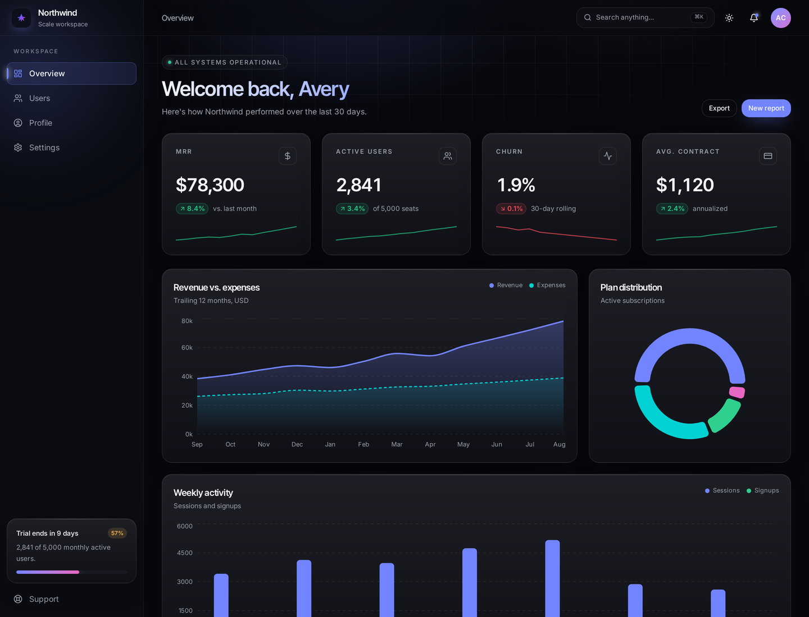
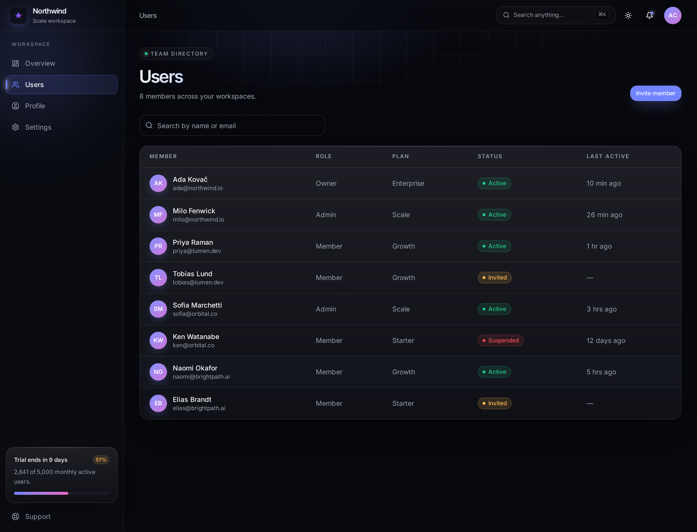
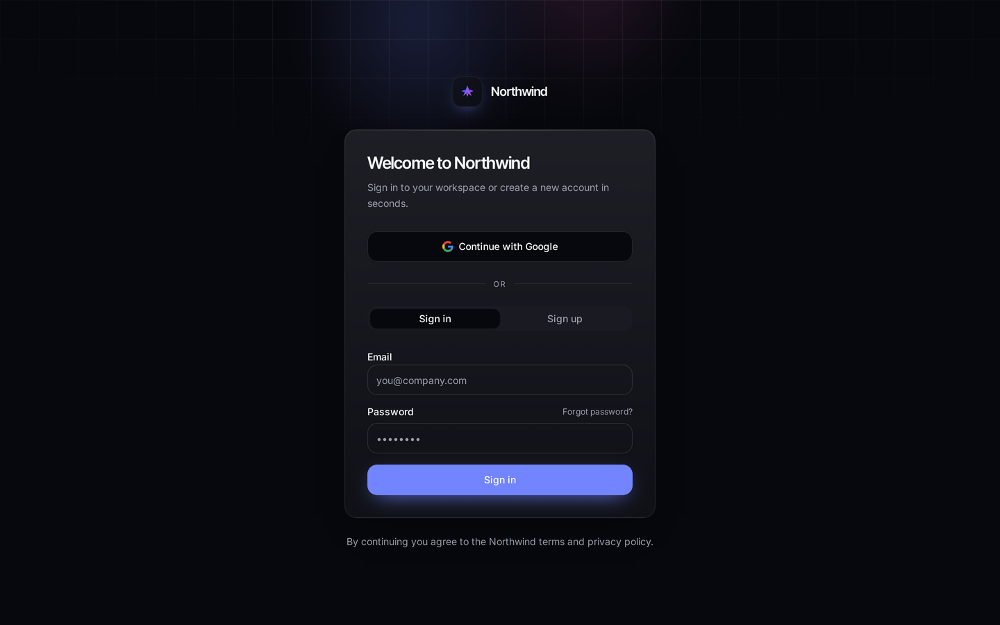
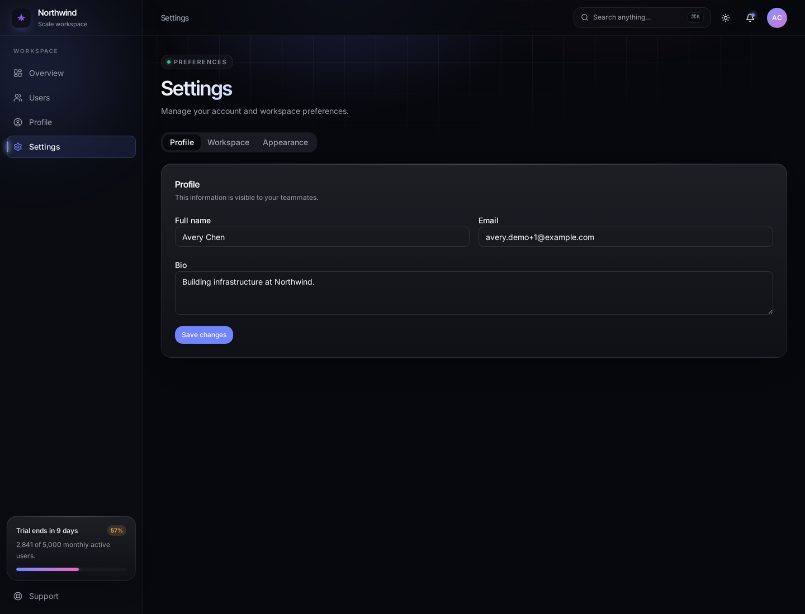
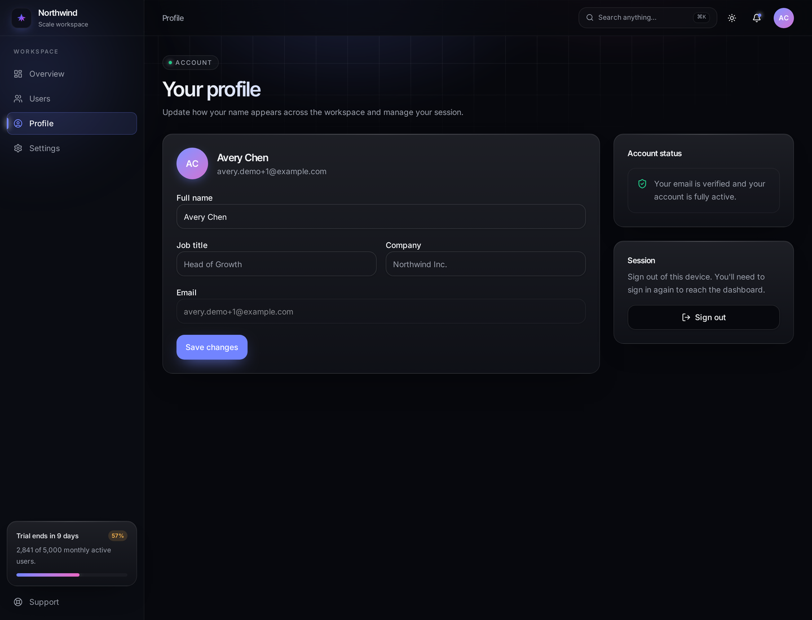
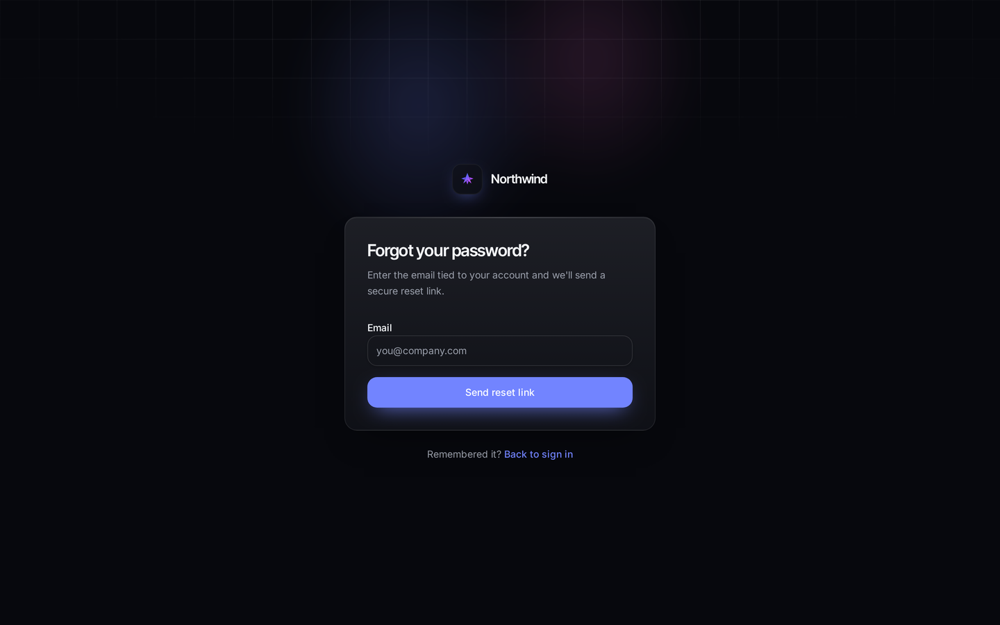

<div align="center">


# Northwind — Modern SaaS Analytics Dashboard

A production-grade SaaS dashboard with authentication, live analytics and a Linear/Vercel-inspired dark UI.

[](https://react.dev)
[](https://www.typescriptlang.org)
[](https://tanstack.com/start)
[](https://tailwindcss.com)
[](https://vite.dev)
[](https://supabase.com)
[](https://recharts.org)
[](LICENSE)

</div>

---



## Overview

Northwind is a full-stack SaaS analytics dashboard: email/password and Google authentication, protected routes, user profiles stored in Postgres, and KPI cards, charts, activity feed and a team directory all rendered from live database data. The design language — deep indigo-violet surfaces, ambient glow, gradient-edged cards — is inspired by Linear, Vercel and Stripe.

## Features

- **Authentication** — email/password + Google OAuth, sign-up, email verification, forgot/reset password, sign-out with cache teardown
- **Protected routes** — `/dashboard`, `/users`, `/profile`, `/settings` gated behind an authenticated layout
- **User profiles** — full name, job title, company persisted in Postgres with row-level security
- **Live analytics** — MRR, active users, churn and average contract KPIs derived from 12 months of metrics
- **Charts** — revenue vs. expenses area chart, plan distribution donut, weekly activity bars (Recharts)
- **Recent activity feed** — categorized events (billing, security, system, team, incidents) with relative timestamps
- **Quick actions** — one-click shortcuts for common workspace operations
- **Team directory** — searchable, filterable user table backed by the database
- **Dark mode** — persisted theme with a refined light variant
- **Responsive** — mobile navigation, fluid grids, touch-friendly targets
- **Design system** — semantic OKLCH tokens, reusable shadcn/ui primitives, no hardcoded colors

## Screenshots

| Overview | Team directory |
| --- | --- |
|  |  |

| Sign in | Settings |
| --- | --- |
|  |  |

| Profile | Password recovery |
| --- | --- |
|  |  |

## Tech Stack

| Layer | Technology |
| --- | --- |
| Framework | TanStack Start v1 (React 19, SSR + server functions) |
| Routing | TanStack Router (file-based, typed) |
| Data | TanStack Query |
| Language | TypeScript 5 |
| Styling | Tailwind CSS v4 (CSS-first theme tokens) |
| UI primitives | shadcn/ui + Radix UI |
| Charts | Recharts |
| Icons | lucide-react |
| Backend | Postgres, Auth and Storage (Supabase-powered) with row-level security |
| Build | Vite 7 |
| Deploy | Edge runtime (Cloudflare Workers compatible) |

## Installation

**Prerequisites:** Node.js 20+ (or [Bun](https://bun.sh) 1.1+) and a backend project providing the Supabase-compatible environment variables.

```bash
# 1. Clone
git clone https://github.com/<your-username>/northwind-dashboard.git
cd northwind-dashboard

# 2. Install
bun install        # or: npm install

# 3. Configure environment
cp .env.example .env   # then fill in the values below

# 4. Run
bun run dev        # or: npm run dev
```

The app starts on **http://localhost:8080**.

### Environment variables

| Variable | Scope | Purpose |
| --- | --- | --- |
| `VITE_SUPABASE_URL` | client | Backend API URL |
| `VITE_SUPABASE_PUBLISHABLE_KEY` | client | Public anon key |
| `SUPABASE_URL` | server | Backend API URL for server functions |
| `SUPABASE_PUBLISHABLE_KEY` | server | Public key for server-side reads |
| `SUPABASE_SERVICE_ROLE_KEY` | server | Privileged operations only — never expose to the client |

### Database

Migrations live in `supabase/migrations/` and create the `profiles`, `monthly_metrics`, `daily_metrics`, `plan_distribution`, `team_members` and `activity_events` tables, together with RLS policies and seeded demo analytics.

## Usage

```bash
bun run dev        # start the dev server on :8080
bun run build      # production build
bun run preview    # preview the production build
bun run lint       # lint the codebase
bun run format     # format with Prettier
```

1. Open `/auth` and create an account (or continue with Google).
2. Confirm your email address, then sign in.
3. You land on `/dashboard` with live KPIs, charts and activity.
4. Manage your team at `/users`, your account at `/profile`, and preferences at `/settings`.

## Project Structure

```text
.
├── docs/
│   ├── logo.png                 # brand mark used in this README
│   └── screenshots/             # UI screenshots
├── public/
│   ├── favicon.png              # generated from the brand mark
│   └── robots.txt
├── src/
│   ├── assets/                  # logo source art
│   ├── components/
│   │   ├── auth/                # auth layout shell
│   │   ├── dashboard/           # stat cards, charts, activity, quick actions
│   │   ├── layout/              # sidebar, topbar, app shell
│   │   └── ui/                  # shadcn/ui primitives
│   ├── integrations/supabase/   # generated backend clients & types
│   ├── lib/
│   │   ├── auth.tsx             # auth provider & session state
│   │   ├── dashboard-data.ts    # typed queries + KPI derivation
│   │   └── theme.tsx            # dark/light theme provider
│   ├── routes/
│   │   ├── __root.tsx           # root layout, head metadata, providers
│   │   ├── index.tsx            # public entry / redirect
│   │   ├── auth.tsx             # sign in + sign up
│   │   ├── forgot-password.tsx
│   │   ├── reset-password.tsx
│   │   ├── verify-email.tsx
│   │   └── _authenticated/      # protected subtree
│   │       ├── route.tsx        # auth gate
│   │       ├── dashboard.tsx
│   │       ├── users.tsx
│   │       ├── profile.tsx
│   │       └── settings.tsx
│   └── styles.css               # Tailwind v4 theme tokens & utilities
├── supabase/migrations/         # SQL schema + seed data
└── vite.config.ts
```

## Roadmap

- [x] Responsive dashboard shell with sidebar and topbar
- [x] Analytics KPIs, charts, activity feed and quick actions
- [x] Email/password + Google authentication with protected routes
- [x] Postgres-backed profiles and live dashboard data
- [ ] Team invitations and role-based access control
- [ ] CSV / PDF report export
- [ ] Realtime metric updates via websockets
- [ ] Billing and subscription management
- [ ] Notification center with read state
- [ ] Audit log with filtering and search
- [ ] End-to-end tests (Playwright) in CI

## Contributing

Issues and pull requests are welcome. Please run `bun run lint` before opening a PR.

## License

Distributed under the MIT License. See [LICENSE](LICENSE) for details.
